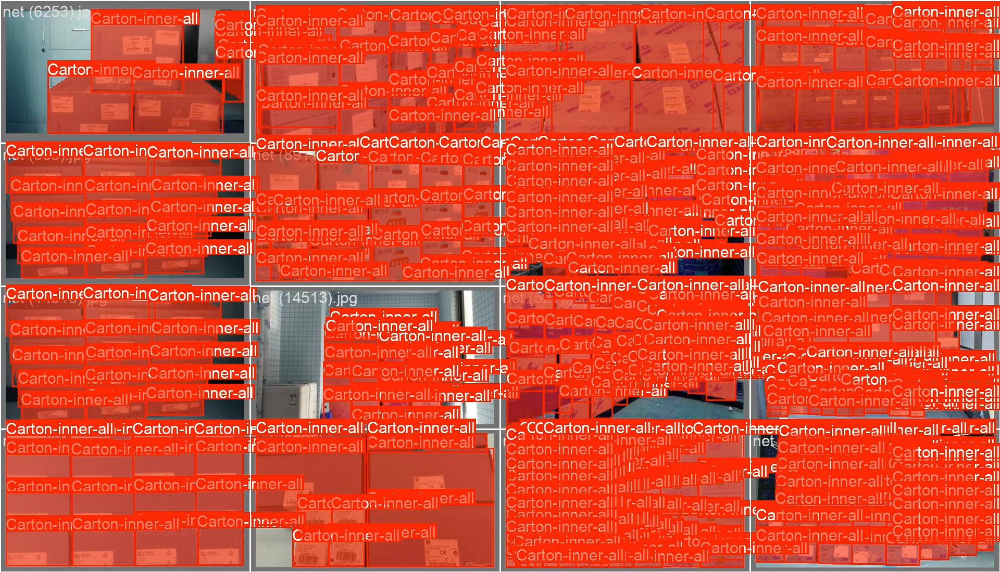
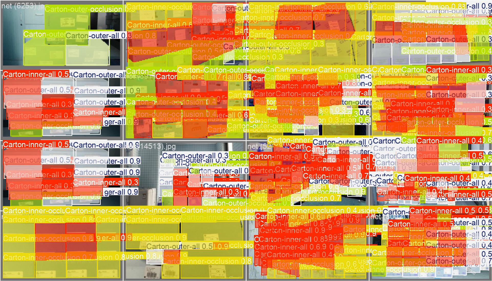
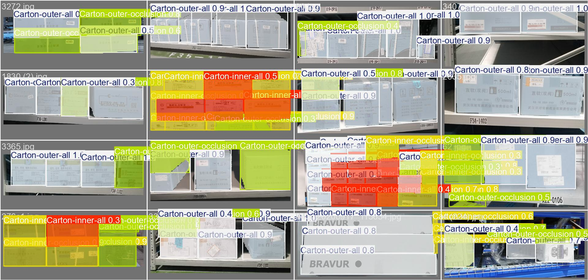
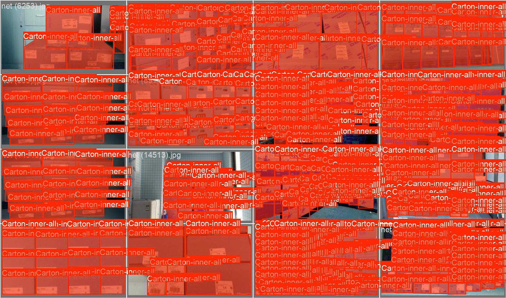
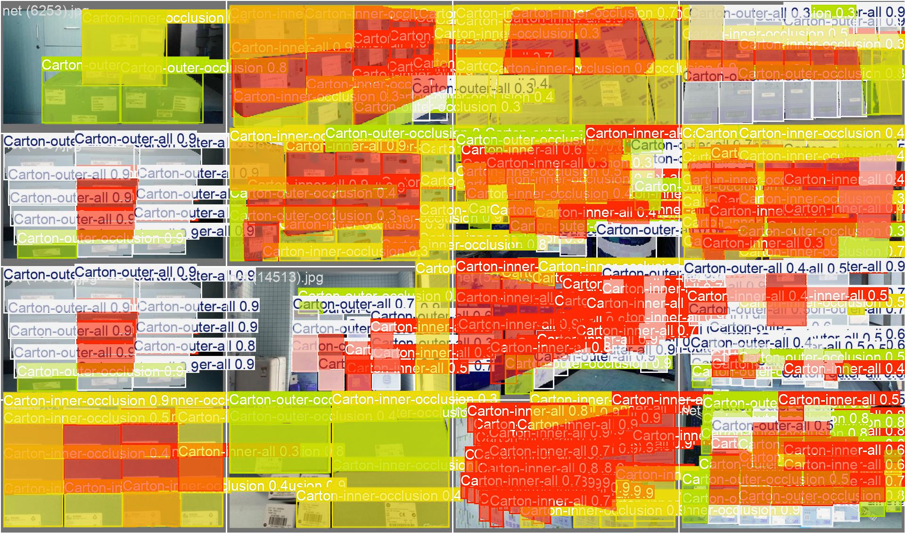
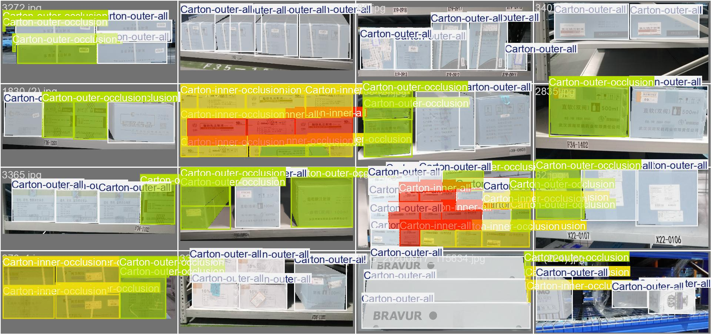
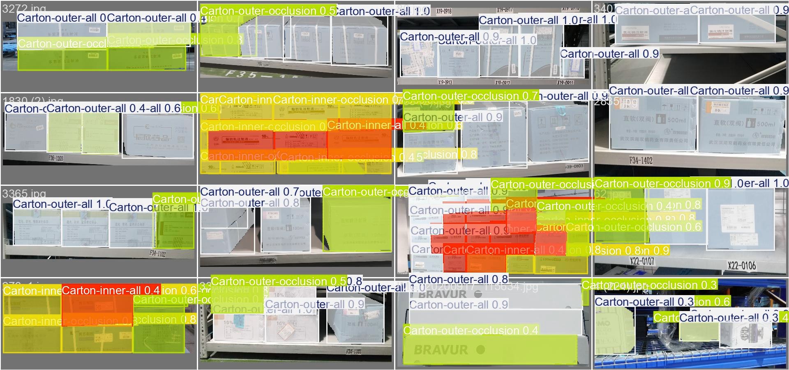
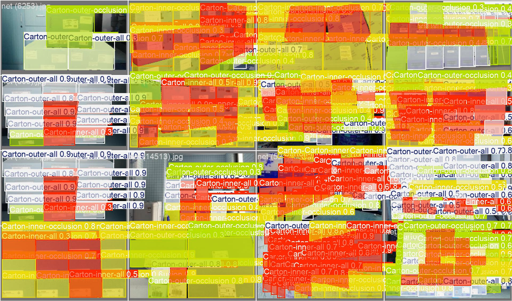
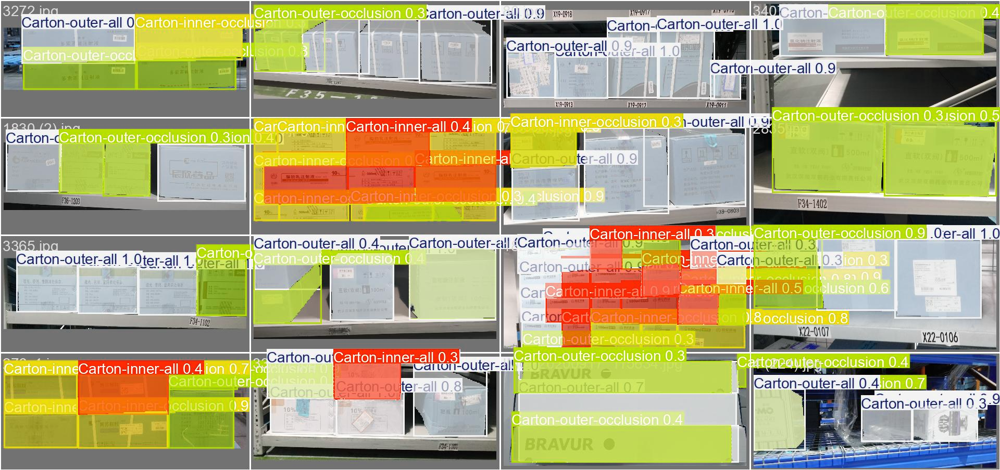
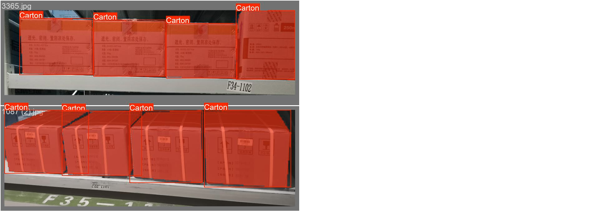

# BoXYZ - Evaluate YOLO Carton Box Segmentation 

⚠️⚠️⚠️ WARNING ⚠️⚠️⚠️ **MAKE SURE YOU DOWNLOADED AND PROCESSED THE SCD CARTON DATASET BY [RUNNING NOTEBOOK 2.1](./2.1_download_preprocess_datasets.ipynb)**

Here I evaluate the SCD carton dataset on the instance segmentation task using YOLOv9 (compact) and YOLOv11 (small and medium).

**Assumptions and Observations**

- Following the approach in the [SCD paper](https://www.mdpi.com/1424-8220/22/10/3617), I fine-tuned on the LSCD after training on the OSCD. Although this is how the authors described the training for the object detection task, it is not clear how they trained/pretrained the models for the instance segmentation task: OSCD followed by LSCD or both combined? 
- I therefore tried both: 
    - OSCD (1 label) pretraining followed by LSCD (4 labels) fine-tuning, 
    - MSCD (1 label) fine-tuning: I created an MSCD dataset which combines OSCD (1 label) and LSCD (1 label). This is most likely what is referred to as the "SCD" dataset in the paper when training for the instance segmentation task. 
- I limited the models to those that can be trained locally on a standalone consumer-grade GPU (RTX 3080Ti) without compromising on training quality e.g., by setting batch size to 1, lowering floating precision, using PEFT, etc.

**Loss Functions**

YOLOv9 and YOLOv11 both use ultralytics YOLOv8's segmentation losses. YOLOv8's loss employs a combination of:
- classification loss (gain $\lambda=0.5$) implemented as Cross-Entropy (CE) loss and is used to predict the class probabilities of detected objects,
- segmentation loss (gain $\lambda=7.5$) implemented using binary CE with Logits, which measures the difference between predicted and ground-truth mask,
- box loss (gain $\lambda=7.5$) which is a weighted sum of the Intersection over Union (IoU) loss and Distribution Focal Loss (DFL) for localizing the objects,
- DFL (gain $\lambda=1.5$) augments the IoU (box loss) and is applied additionally for improving bbox regression by predicting a distribution rather than direct coordinates of box boundaries.


---
---

## OSCD Pretraining + OSCD (4 Labels) Fine-Tuning

<a id="yolov9-setup-and-hyperparameters"></a>
### YOLOv9 Setup and Hyperparameters

I used the [YOLOv9c model (Generalized Efficient Layer Aggregation Network [GELAN])](https://arxiv.org/abs/2402.13616), fine-tuning it on the OSCD dataset followed by the LSCD dataset. The YOLOv9c is a "compact" variant of the YOLOv9 family that is larger (25.5M parameters) than the medium (20.1M parameters) and small (7.2M parameters) variants. I chose most hyper-parameters based on non-exhastive trial and error, on YOLOv9c's default settings, SCD's settings as reported in the [SCD paper](https://www.mdpi.com/1424-8220/22/10/3617), best-practices, or due to resource limitation (single RTX-3080Ti GPU).

During training, the following data augmentations with provided probabilities are applied (following the [YOLOv9 training setup](https://arxiv.org/abs/2402.13616) for the most part but additional/removals by ultralytics defaults for better performance):
- HSV saturation augmentation 0.7
- HSV value augmentation 0.4
- translation augmentation 0.1
- scale augmentation 0.5
- mosaic augmentation 1.0 (mosaic is disable for last 10 epochs during pretraining and fine-tuning)
- flip left & right augmentation 0.5

During the OSCD pretraining, none of the layers were frozen and were trained using the AdamW optimizer with a batch size of 64 (mini-batch 8 with gradient accumulation upto 64). The learning rate is automatically determined at 0.00125 with a momentum of 0.937). The remaining hyper-parameters were set to their defaults based on the YOLOv9c settings in [ultralytics](https://www.ultralytics.com/). The image size was set to [600,1000] following SCD's training+finetuning specs for the object detection task: pretraining image size was [600,1000] in the SCD paper although the task was different. However, The for training the YOLO series for instance segmentation, the image size has to be of 1:1 ratio during training, and a multiple of of stride 32. This automatically sets the image size to nearest highest multiple of 32: [1024,1024]

During the LSCD fine-tuning phase, 10 layers were frozen (because the images are larger and the OSCD low-level features won't have to be altered significantly to work with LSCD) and the remaining params were trained using the AdamW optimizer as well. The batch size was set to 4 (following the SCD's default mini-batch size for training models). Here we also enabled cos annealing with a final learning rate of $1e^{-5}$ since the classes and distribution of OSCD and LSCD are similar and we want to escape local minima but not catastrophically forget the features learned from OSCD. The image size was set to [800,1033] but was automatically reset to [1056,1056].


### YOLOv9c Evaluation


```python
model_name = f"{MODEL_NAME_PREFIX}2.2B_2_ft_lscd_yolo9c_epoch60"
model_eval = YOLO(os.path.join('runs', 'segment', model_name, 'weights', 'last.pt'))
eval_yolo9c_oscd_results = model_eval.val(data=os.path.join(DS_LOCATION, 'ultralytics_carton_oscd', 'data.yaml'))
eval_yolo9c_lscd_results = model_eval.val(data=os.path.join(DS_LOCATION, 'ultralytics_carton_lscd', 'data.yaml'))
```


---


    YOLOv9c OSCD Ground Truth Labels:


    

    


    YOLOv9c Model OSCD Predictions:


    

    


---


    YOLOv9c LSCD Ground Truth Labels:


    

    


    YOLOv9c Model LSCD Predictions:


    

    


---
<a id="yolov11-setup-and-hyperparameters"></a>
### YOLOv11 Setup and Hyperparameters

I used the YOLO11 model which enhances the YOLOv8's C2F: The authors claim C2F is extension of the [Channel-wise Feature Pyramid (CFPNet)](https://arxiv.org/abs/2103.12212) which is very similar (identical?) to [(Efficient Layer Aggregation Network [ELAN])](https://arxiv.org/abs/2402.13616), fine-tuning it on the OSCD dataset followed by the LSCD dataset. I tried both the YOLOv11s "small" (10.1M parameters) and YOLOv11m "medium" (22.4M parameters). Most hyperparameters are identical to the [setup of YOLOv9](#yolov9-setup-and-hyperparameters).

During the OSCD pretraining, none of the layers were frozen and were trained using the AdamW optimizer with a batch size of 64 (mini-batch 4 with gradient accumulation upto 64). The learning rate is automatically determined at 0.00125 with a momentum of 0.9). The image size is automatically set to [1024,1024]

During the LSCD fine-tuning phase, 10 layers were frozen and the remaining params were trained using the AdamW optimizer as well. The batch size was set to 4. Here we also enabled cos annealing with a final learning rate of $1e^{-5}$. The image size is automatically set to  [1056,1056].


### YOLOv11s Evaluation


```python
model_name = f"{MODEL_NAME_PREFIX}2.2C_2_ft_lscd_yolo11s_epoch60"
model_eval = YOLO(os.path.join('runs', 'segment', model_name, 'weights', 'last.pt'))
eval_yolo11s_oscd_results = model_eval.val(data=os.path.join(DS_LOCATION, 'ultralytics_carton_oscd', 'data.yaml'))
eval_yolo11s_lscd_results = model_eval.val(data=os.path.join(DS_LOCATION, 'ultralytics_carton_lscd', 'data.yaml'))
```


---


    YOLOv11s OSCD Ground Truth Labels:


    

    


    YOLOv11s Model OSCD Predictions:


    

    


---


    YOLOv11s LSCD Ground Truth Labels:


    

    


    YOLOv11s Model LSCD Predictions:


    

    


### YOLOv11m Evaluation


```python
model_name = f"{MODEL_NAME_PREFIX}2.2D_2_ft_lscd_yolo11m_epoch60"
model_eval = YOLO(os.path.join('runs', 'segment', model_name, 'weights', 'last.pt'))
eval_yolo11m_oscd_results = model_eval.val(data=os.path.join(DS_LOCATION, 'ultralytics_carton_oscd', 'data.yaml'))
eval_yolo11m_lscd_results = model_eval.val(data=os.path.join(DS_LOCATION, 'ultralytics_carton_lscd', 'data.yaml'))
```


---


    YOLOv11m OSCD Ground Truth Labels:


    

    


    YOLOv11m Model OSCD Predictions:


    

    


---


    YOLOv11m LSCD Ground Truth Labels:


    

    


    YOLOv11m Model LSCD Predictions:


    

    


---
---


## MSCD (OSCD + LSCD 1 Label) Fine-Tuning

### Setup and Hyperparameters

I used the YOLOv9c and YOLO11 (YOLOv11s and YOLOv11m) models for fine-tuning on the MSCD dataset. The hyperparameters follow the [YOLOv9 setup](#yolov9-setup-and-hyperparameters) and [YOLO11 setup](#yolov11-setup-and-hyperparameters) for **fine-tuning**. Only difference is I ran the training for 12 epochs on all models, in alignment with the benchmarks presented in the [SCD paper](https://www.mdpi.com/1424-8220/22/10/3617). The image size is automatically set to [1056,1056] (nearest size possible to [800,1033]).

### YOLOv9c Evaluation


```python
model_name = f"{MODEL_NAME_PREFIX}2.2E_ft_mscd_yolo9c_epoch12"
model_eval = YOLO(os.path.join('runs', 'segment', model_name, 'weights', 'last.pt'))
eval_yolo9c_mscd_results = model_eval.val(data=os.path.join(DS_LOCATION, 'ultralytics_carton_mscd', 'data.yaml'),
                                          batch=2)
```


---


    YOLOv9c MSCD Ground Truth Labels:


    

    


<a id='sample-corner-artifact-yolov9c'></a>


    YOLOv9c Model MSCD Predictions:


    

    


### YOLOv11s Evaluation


```python
model_name = f"{MODEL_NAME_PREFIX}2.2F_ft_mscd_yolo11s_epoch12"
model_eval = YOLO(os.path.join('runs', 'segment', model_name, 'weights', 'last.pt'))
eval_yolo11s_mscd_results = model_eval.val(data=os.path.join(DS_LOCATION, 'ultralytics_carton_mscd', 'data.yaml'),
                                          batch=2)
```


---


    YOLOv11s MSCD Ground Truth Labels:


    

    


<a id='sample-corner-artifact-yolov11s'></a>


    YOLOv11s Model MSCD Predictions:


    

    


### YOLOv11m Evaluation


```python
model_name = f"{MODEL_NAME_PREFIX}2.2G_ft_mscd_yolo11m_epoch12"
model_eval = YOLO(os.path.join('runs', 'segment', model_name, 'weights', 'last.pt'))
eval_yolo11m_mscd_results = model_eval.val(data=os.path.join(DS_LOCATION, 'ultralytics_carton_mscd', 'data.yaml'),
                                          batch=2)
```


---


    YOLOv11m MSCD Ground Truth Labels:


    

    


    YOLOv11m Model MSCD Predictions:


    

    


---
---

## Results

All models I trained slightly under-perform the SOLOv2 ($m\!A\!P\!_{seg} = 88.9$) and HTC ($m\!A\!P\!_{seg} = 89.6$) models trained on the full SCD (combined evaluation and training on both OSCD and LSCD) as reported in the [SCD paper](https://www.mdpi.com/1424-8220/22/10/3617). This is due to:
- my choice of models, which are not the largest (best) variants of their model families. The benchmark model results are reported in the SCD paper, but the hyperparameters  are not mentioned for each. I would assume that the best variant was used for the comparison hence the better performance relative to the models I trained,    
- me not performing an exhaustive hyper-parameter search or modifying the model to specifically address the carton segmentation/detection task e.g., [Boundary Guided Supervision (BGS)](https://www.mdpi.com/1424-8220/22/10/3617). This could potentially improve performance, not only for the YOLO models but also the instance segmentation benchmark models which were not adapted to the carton box segmentation task either. 


### Benchmark Performance (from [SCD paper](https://www.mdpi.com/1424-8220/22/10/3617))

The following table shows the performance metrics from the original SCD paper:

| Method | Eval Dataset | Epochs | mAPbox | APbox 50 | APbox 75 | mAPseg | APseg 50 | APseg 75 |
|--------|----------|--------|----------|----------|--------|----------|----------|----------|
| Mask R-CNN | MSCD | 12 | 85.2 | 96.1 | 91.8 | 88.0 | 96.1 | 93.1 |
| BlendMask | MSCD | 12 | 86.1 | 96.2 | 92.0 | 88.5 | 96.3 | 93.3 |
| Cascade Mask R-CNN | MSCD | 12 | 87.6 | 96.6 | 92.1 | 89.0 | 96.6 | 93.7 |
| HTC | MSCD | 12 | 88.2 | 96.7 | 93.0 | 89.6 | 96.6 | 94.0 |
| YOLACT | MSCD | 12 | 66.6 | 90.6 | 77.8 | 71.7 | 90.5 | 80.4 |
| SOLOv1 | MSCD | 12 | - | - | - | 79.0 | 92.9 | 86.2 |
| SOLOv2 | MSCD | 12 | 84.3 | 95.7 | 91.0 | 88.9 | 96.2 | 93.6 |

**NOTE** I assume the `SCD` dataset reported in the benchmarks corresponds to the `MSCD` dataset.

### Fine-Tuned Model Performance

All `O+L` models were first pretrained for 17 epochs on OSCD followed by 60 epochs of fine-tuning on LSCD (4 labels). 
All `M` models were trained for 12 epochs (similar to the benchmarks) on the MSCD combined OSCD and LSCD (1 label) datasets

| Method | Eval Dataset | Epochs | mAPbox | APbox 50 | APbox 75 | mAPseg | APseg 50 | APseg 75 |
|--------|----------|--------|----------|----------|--------|----------|----------|----------|
|YOLOv9c (O+L) | OSCD    | 60      | 66.0 | 76.0 | 70.5 | 64.3 | 76.0 | 70.4 |
|YOLOv9c (O+L) | LSCD    | 60      | 79.3 | 85.2 | 82.8 | 77.0 | 85.2 | 82.8 |
|YOLOv11s (O+L) | OSCD    | 60      | 70.6 | 80.0 | 75.6 | 70.7 | 80.0 | 76.1 |
|YOLOv11s (O+L) | LSCD    | 60      | 81.9 | 87.5 | 85.6 | 81.6 | 87.5 | 86.1 |
|YOLOv11m (O+L) | OSCD    | 60      | 70.6 | 79.8 | 75.6 | 70.8 | 79.9 | 76.2 |
|YOLOv11m (O+L) | LSCD    | 60      | 80.4 | 86.1 | 84.1 | 80.0 | 86.1 | 84.5 |
|YOLOv9c (M) | MSCD    | 12      | 88.1 | 96.6 | 93.3 | 87.5 | 96.6 | 93.1 |
|YOLOv11s (M) | MSCD    | 12      | 86.8 | 96.3 | 92.2 | 85.9 | 96.3 | 92.1 |
|YOLOv11m (M) | MSCD    | 12      | 87.9 | 96.7 | 93.1 | 87.3 | 96.6 | 93.0 |


## Observations

- Contrary to expectation, YOLOv11m underperforms YOLOv11s under the `O+L` (pretraining on OSCD and fine-tuning on LSCD) condition. This could be due to the SCD dataset's moderate number of samples. Training with more samples could lead to the opposite result. Additionally, I use the same hyperparameters for all models regardless of their size. However, the number of initial layers frozen (10 layers) could significantly affect the model's number of trainable parameters. Instead, freezing the parts of the model should be related to a block section in the model (e.g., the backbone encoder) rather than the number of layers. Moreover, a larger model could require more training iterations to bias its distribution toward a specific class (in this case, carton). This is supported by the fact that under the `M` (fine-tuning on the MSCD) condition, where the MSCD has x2 the number of samples as LSCD, YOLOv11m outperforms YOLOv11s as expected. 
- All segmentation models seem to produce artifacts around dark regions (look at the patchy mask on the top-right corner of right-most carton box seen in the predicted images (second sample) [here](#sample-corner-artifact-yolov9c) and [here](#sample-corner-artifact-yolov11s)). This could be due to the data augmentation during training, namely the HSV augmentation. Another reason could be related to the resizing of the images, since the used YOLO models expect 1:1 image ratios during training, resulting in some regions becoming to narrow for the model to infer any meaningful features.
- The MSCD metric scores seem much closer to the benchmark than OSCD+LSCD, so it's very likely this is how the instance segmentation task was trained in the SCD paper rather than the pretraining + fine-tuning approach.
- YOLOv9 is more susceptible to catastrophic forgetting (shifts further away from the pretrained OSCD's distribution) than YOLO11. Although YOLOv9c (model with the most parameters among the three) outperforms YOLOv11s and YOLOv11m under the `M` condition, this is not the case under the `O+L` condition. I currently don't know the reason behind that, but it is worth investigating.
